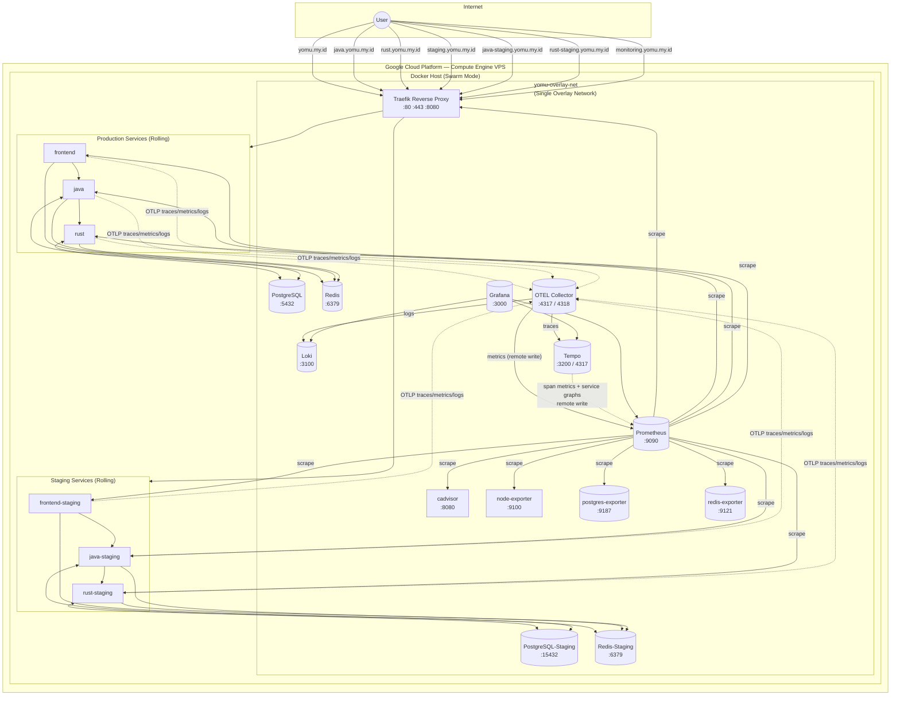
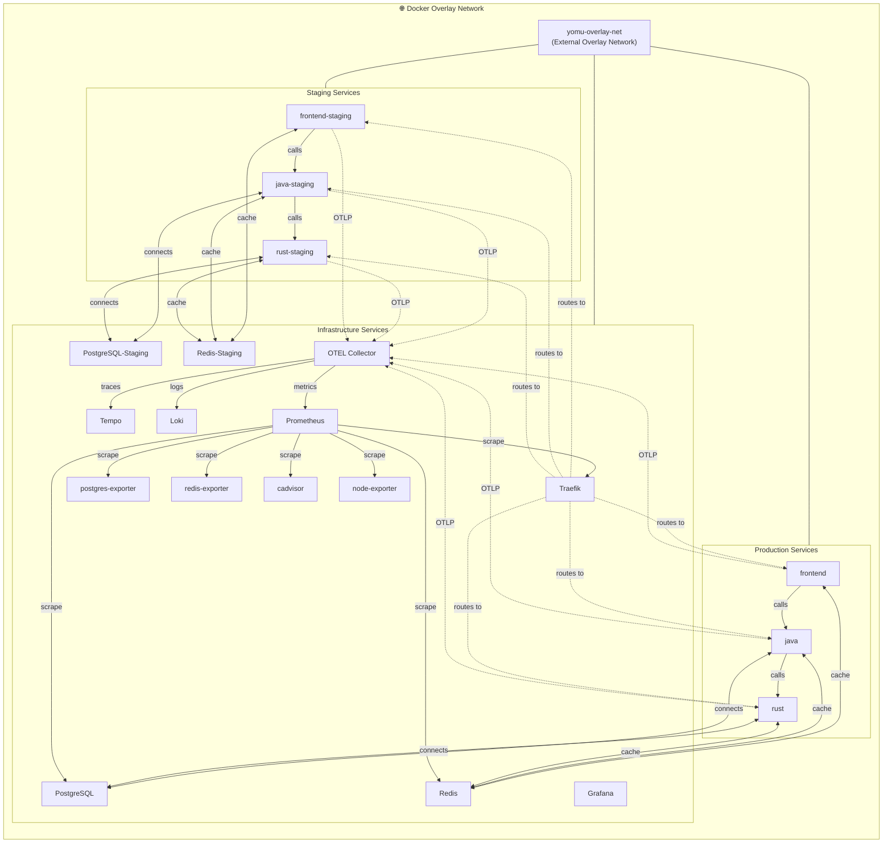
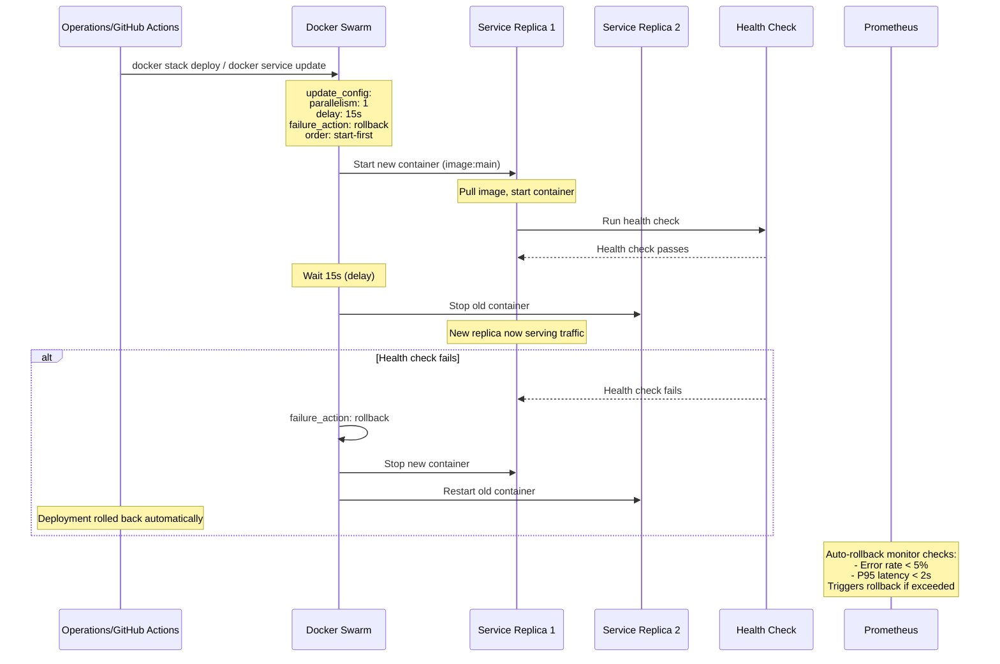
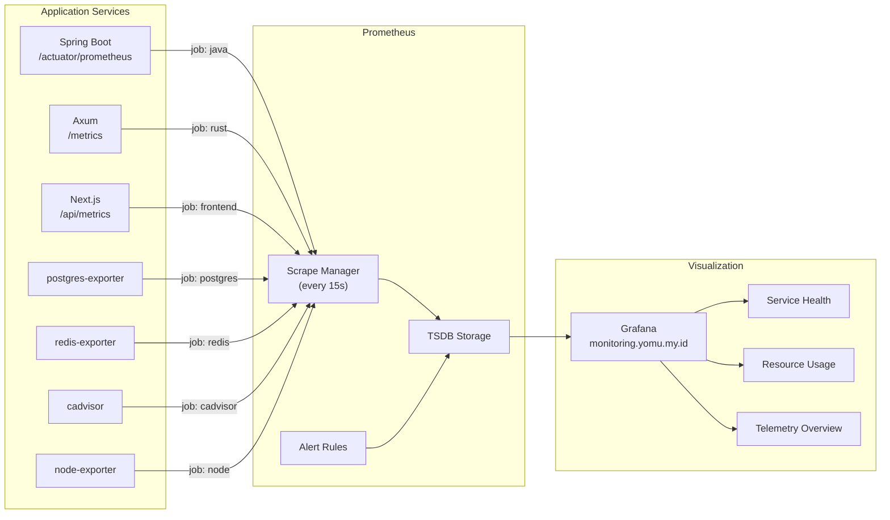
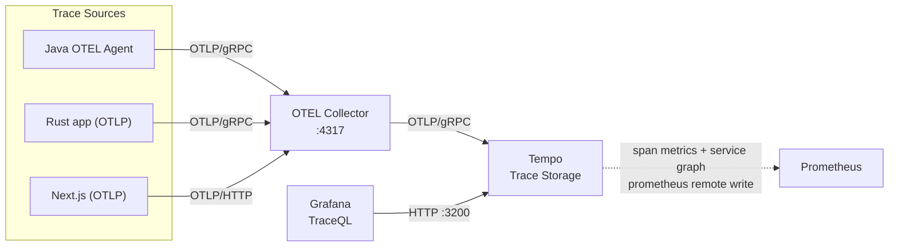
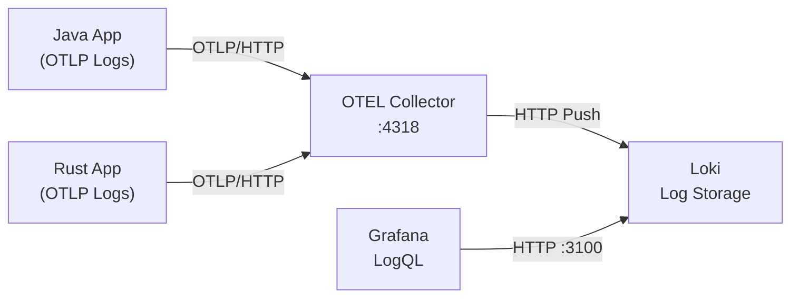
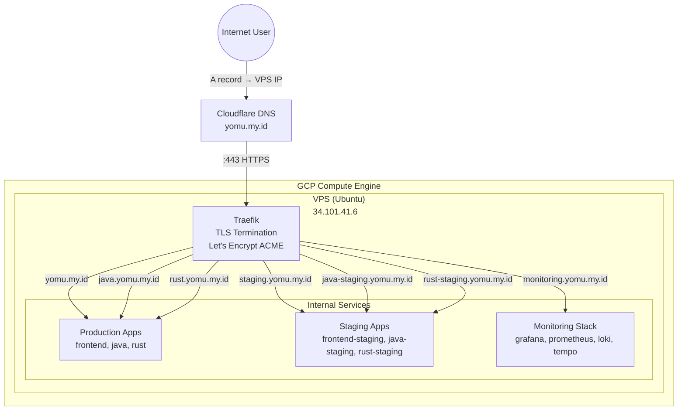
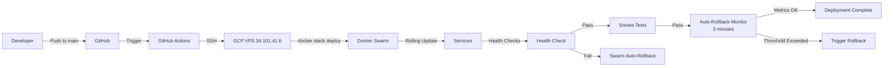
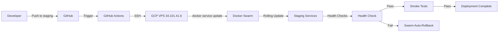

# Yomu Platform — Architecture

**Platform**: Google Cloud Compute Engine (VPS)
**Domain**: yomu.my.id
**Deployment**: Rolling Deployment via Docker Swarm + Traefik
**Environments**: Production (rolling), Staging (rolling)

---

## 1. System Overview



### Components

| Component | Role | Docker Image | Internal Port |
|-----------|------|-------------|---------------|
| Traefik | Reverse proxy, TLS termination, routing (Swarm provider) | `traefik:v3.6` | :80, :443, :8080 (dashboard) |
| PostgreSQL | Relational DB (4 databases) | `postgres:18-alpine` | :5432 |
| PostgreSQL-Staging | Separate staging database | `postgres:18-alpine` | :15432 (host) |
| Redis | Cache, session store, leaderboard (production) | `redis:8-alpine` | :6379 |
| Redis-Staging | Separate staging Redis | `redis:8-alpine` | :6379 |
| Prometheus | Metrics collection + alerting | `prom/prometheus:v2.53.0` | :9090 |
| Grafana | Metrics visualization + dashboards | `grafana/grafana:11.0.0` | :3000 |
| Loki | Log aggregation | `grafana/loki:3.0.0` | :3100 |
| Tempo | Distributed tracing storage + query | `grafana/tempo:2.5.0` | :3200 (HTTP), :4317 (OTLP gRPC) |
| OTEL Collector | Telemetry pipeline | `otel/opentelemetry-collector-contrib:0.104.0` | :4317, :4318, :8889 |
| cadvisor | Container metrics | `gcr.io/cadvisor/cadvisor:v0.49.1` | :8080 |
| node-exporter | Host system metrics | `prom/node-exporter:v1.8.2` | :9100 |
| postgres-exporter | PostgreSQL metrics → Prometheus | `prometheuscommunity/postgres-exporter:v0.15.0` | :9187 |
| redis-exporter | Redis metrics → Prometheus | `oliver006/redis_exporter:v1.58.0` | :9121 |

### Service Communication

All services communicate over the single `yomu-overlay-net` overlay network. Docker Swarm provides DNS-based service discovery, so services can reach each other by name (e.g., `java:8080`, `postgres:5432`).

---

## 2. Network Architecture



### Network Configuration

| Network | Type | Members | Purpose |
|---------|------|---------|---------|
| `yomu-overlay-net` | External Overlay | ALL services | Single network for all service communication, DNS-based discovery |

### Overlay Networking

Docker Swarm overlay networks provide:

- **DNS-based service discovery**: Services can reach each other by name (e.g., `postgres:5432`)
- **Encrypted traffic**: Optional encryption between swarm nodes (single node in this deployment)
- **Load balancing**: Built-in load balancing across service replicas
- **Rolling updates**: Seamless updates without network interruption

All services connect to the same overlay network, enabling direct communication without network hops or proxies between application tiers.

---

## 3. Rolling Deployment Pattern

### Deployment Flow



### Rolling Update Configuration

Each production service in `docker-compose.swarm.yml` has:

```yaml
deploy:
  update_config:
    parallelism: 1        # Update one replica at a time
    delay: 15s            # Wait 15 seconds between replicas
    failure_action: rollback  # Automatically rollback on failure
    order: start-first    # Start new container before stopping old
  restart_policy:
    condition: on-failure
    delay: 5s
```

### Deployment Sequence

1. **GitHub Actions** triggers deployment via SSH
2. **SSH** connects to VPS (34.101.41.6)
3. **docker stack deploy** applies the stack file
4. **Swarm** processes each service with `update_config`:
   - Starts new container with updated image
   - Waits for health check to pass
   - Waits 15 seconds (delay)
   - Stops old container
5. **Smoke tests** verify endpoints are responding
6. **Auto-rollback monitor** watches metrics for 5 minutes post-deploy

### Automatic Rollback Triggers

Rollback occurs automatically when:

1. **Health check fails** during rolling update → Swarm native rollback
2. **Error rate exceeds 5%** → `auto-rollback-monitor.sh` triggers `docker service rollback`
3. **P95 latency exceeds 2s** → `auto-rollback-monitor.sh` triggers `docker service rollback`

### Auto-Rollback Monitor

The `scripts/auto-rollback-monitor.sh` script runs continuously after deployment:

```bash
# Configuration
MONITOR_DURATION_MINUTES=5
CHECK_INTERVAL_SECONDS=15
MAX_ERROR_RATE=5.0
MAX_LATENCY_SECONDS=2.0
```

It queries Prometheus for:
- `sum(rate(traefik_service_requests_total{code=~"5.."}[1m])) / sum(rate(traefik_service_requests_total[1m])) * 100`
- `histogram_quantile(0.95, sum(rate(traefik_entrypoint_request_duration_seconds_bucket[1m])) by (le))`

If thresholds are exceeded, it executes `docker service rollback <service_name>` to revert to the previous version.

---

## 4. Request Routing

### Subdomain-Based Routing Matrix

Traefik uses the **Swarm provider** with labels on services for automatic routing. No file-based routing switches needed.

| Host | Router Label | Service | Environment |
|------|--------------|---------|-------------|
| `yomu.my.id` | `frontend-router` | `frontend` | Production |
| `java.yomu.my.id` | `java-router` | `java` | Production |
| `rust.yomu.my.id` | `rust-router` | `rust` | Production |
| `staging.yomu.my.id` | `frontend-staging-router` | `frontend-staging` | Staging |
| `java-staging.yomu.my.id` | `java-staging-router` | `java-staging` | Staging |
| `rust-staging.yomu.my.id` | `rust-staging-router` | `rust-staging` | Staging |
| `monitoring.yomu.my.id` | `grafana-router` | `grafana` | Infrastructure |

### Traefik Labels Example

Each service has labels that configure routing:

```yaml
labels:
  - "traefik.enable=true"
  - "traefik.http.routers.java.rule=Host(`java.yomu.my.id`)"
  - "traefik.http.routers.java.service=java"
  - "traefik.http.routers.java.tls.certresolver=letsencrypt"
  - "traefik.http.services.java.loadbalancer.server.port=8080"
  - "traefik.http.services.java.loadbalancer.healthcheck.path=/actuator/health/readiness"
  - "traefik.http.services.java.loadbalancer.healthcheck.interval=15s"
```

### Data Flow: Login Request

```mermaid
sequenceDiagram
    actor User
    participant Traefik as Traefik (:443)
    participant FE as frontend:3000
    participant Java as java:8080
    participant PG[("PostgreSQL<br/>yomu_db")]
    participant Rust as rust:8080
    participant Redis[("Redis<br/>Sessions")]

    User->>Traefik: POST /api/java/auth/login<br/>Host: java.yomu.my.id
    Traefik->>Java: Route to java:8080
    Java->>PG: Query user credentials
    PG-->>Java: User data
    Java->>Redis: Store session token
    Java-->>Traefik: {access_token, user}
    Traefik-->>User: HTTP 200 + Set-Cookie

    Note over Java,Redis: Java creates outbox event for Rust user sync

    User->>Traefik: GET /api/rust/leaderboard<br/>Host: rust.yomu.my.id
    Traefik->>Rust: Route to rust:8080
    Rust->>PG: Query leaderboard scores
    PG-->>Rust: Scores
    Rust->>Redis: Cache leaderboard (TTL 60s)
    Rust-->>Traefik: {ranks}
    Traefik-->>User: JSON response
```

### TLS Termination

All TLS termination happens at Traefik. Internal service-to-service communication is unencrypted (within the overlay network). Let's Encrypt certificates are automatically managed via Traefik's ACME resolver.

---

## 5. Database Architecture

```mermaid
erDiagram
    PostgreSQL {
        database yomu_db "Production Java"
        database yomu_engine "Production Rust"
    }

    PostgreSQL-Staging {
        database yomu_db_staging "Staging Java"
        database yomu_engine_staging "Staging Rust"
    }

    yomu_db ||--o{ java : "uses"
    yomu_engine ||--o{ rust : "uses"

    yomu_db_staging ||--o{ java-staging : "uses"
    yomu_engine_staging ||--o{ rust-staging : "uses"

    yomu_db ||--o{ Users : "auth/users"
    yomu_db ||--o{ Articles : "article content"
    yomu_db ||--o{ Quizzes : "quiz content"
    yomu_db ||--o{ Outbox : "sync events to Rust"

    yomu_engine ||--o{ ShadowUsers : "synced from Java"
    yomu_engine ||--o{ Clans : "clan data"
    yomu_engine ||--o{ Leaderboards : "scores"
    yomu_engine ||--o{ Missions : "gamification"

    yomu_db_staging ||--o{ StagingUsers : "test data"
    yomu_db_staging ||--o{ StagingArticles : "test content"
    yomu_engine_staging ||--o{ StagingClans : "test clans"
```



### Database Initialization

On first PostgreSQL start, `scripts/init-databases.sql` is mounted to `/docker-entrypoint-initdb.d/02-init-databases.sql` and executed automatically by the official PostgreSQL Docker image. The script is **idempotent** (uses `IF NOT EXISTS` guards) so it can safely re-run on container restart.

| Database | Created By | Used By | Purpose |
|----------|-----------|---------|---------|
| `yomu_db` | `${POSTGRES_DB}` env var | `java`, `rust` | Auth, users, articles, quizzes, outbox |
| `yomu_engine` | `init-databases.sql` | `rust` | Clans, scores, achievements, shadow users |
| `yomu_db_staging` | `init-databases.sql` | `java-staging` | Staging auth/users/articles |
| `yomu_engine_staging` | `init-databases.sql` | `rust-staging` | Staging clans/leaderboards |

### Redis Separation

| Redis Instance | Used By | Key Prefix | Purpose |
|----------------|---------|------------|---------|
| `redis:6379` | Production services | `prod_` | Sessions, leaderboard cache |
| `redis-staging:6379` | Staging services | `staging_` | Isolated staging cache |

---

## 6. Observability Stack (Full Telemetry)

### Metrics Pipeline



### Traces Pipeline



### Logs Pipeline



### Three Pillars Coverage

| Signal | Technology | Endpoint | Retention |
|--------|-----------|----------|-----------|
| **Metrics** | Prometheus (+ OTEL remote write) | `prometheus:9090` | Unlimited (local storage) |
| **Logs** | OTEL Collector → Loki | `loki:3100` | 7 days |
| **Traces** | OTEL Collector → Tempo | `tempo:3200` (query), `tempo:4317` (ingest) | 7 days |
| **Dashboards** | Grafana (auto-provisioned) | `monitoring.yomu.my.id` | Persistent (volume) |
| **Alerts** | Prometheus Alertmanager (rules defined) | Eval every 15s | — |

### Prometheus Scrape Configuration

The `prometheus.yml` defines jobs for all services:

```yaml
scrape_configs:
  - job_name: prometheus
    static_configs:
      - targets: ['prometheus:9090']

  - job_name: traefik
    static_configs:
      - targets: ['traefik:8080']

  - job_name: java
    metrics_path: /actuator/prometheus
    static_configs:
      - targets: ['java:8080']
    labels:
      environment: production
      service: java

  - job_name: rust
    metrics_path: /metrics
    static_configs:
      - targets: ['rust:8080']
    labels:
      environment: production
      service: rust

  - job_name: frontend
    metrics_path: /api/metrics
    static_configs:
      - targets: ['frontend:3000']
    labels:
      environment: production
      service: frontend

  - job_name: java-staging
    metrics_path: /actuator/prometheus
    static_configs:
      - targets: ['java-staging:8080']
    labels:
      environment: staging
      service: java

  - job_name: rust-staging
    metrics_path: /metrics
    static_configs:
      - targets: ['yomu_rust-staging:8080']
    labels:
      environment: staging
      service: rust

  - job_name: frontend-staging
    metrics_path: /api/metrics
    static_configs:
      - targets: ['frontend-staging:3000']
    labels:
      environment: staging
      service: frontend

  - job_name: postgres
    static_configs:
      - targets: ['postgres-exporter:9187']

  - job_name: redis
    static_configs:
      - targets: ['redis-exporter:9121']
```

### Alert Rules

| Alert | Severity | Trigger | Action |
|-------|----------|---------|--------|
| **ServiceDown** | 🔴 Critical | `up == 0` for 1m | Check `docker service ps`, review logs |
| **DatabaseDown** | 🔴 Critical | `pg_up == 0` | Check PostgreSQL container health |
| **HighErrorRate** | 🟡 Warning | `rate(traefik_service_requests_total{code=~"5.."}[5m]) > 0.1` | Review application logs |
| **HighLatency** | 🟡 Warning | Traefik p95 latency > 2s for 5m | Check DB performance, JVM heap |
| **JavaHeapHigh** | 🟡 Warning | JVM heap > 85% for 5m | Restart Java service or increase memory |
| **DiskSpaceLow** | 🟡 Warning | Disk < 10% (node-exporter) | Clean logs, extend disk |

---

## 7. Domain and TLS Architecture



### DNS Records (yomu.my.id)

| Record | Type | Target | Purpose |
|--------|------|--------|---------|
| `yomu.my.id` | A | 34.101.41.6 | Production frontend |
| `java.yomu.my.id` | A | 34.101.41.6 | Production Java API |
| `rust.yomu.my.id` | A | 34.101.41.6 | Production Rust API |
| `staging.yomu.my.id` | A | 34.101.41.6 | Staging frontend |
| `java-staging.yomu.my.id` | A | 34.101.41.6 | Staging Java API |
| `rust-staging.yomu.my.id` | A | 34.101.41.6 | Staging Rust API |
| `monitoring.yomu.my.id` | A | 34.101.41.6 | Grafana dashboard |

### TLS Configuration

Traefik uses Let's Encrypt via ACME TLS challenge:

```yaml
certificatesResolvers:
  letsencrypt:
    acme:
      tlsChallenge: {}
      email: admin@yomu.my.id
      storage: /etc/traefik/acme.json
```

Certificates are automatically requested and renewed. The ACME state is persisted in `/opt/yomu/traefik/acme.json`.

---

## 8. Directory Structure

```
yomu-deployment/
├── docker-compose/
│   └── docker-compose.swarm.yml         # Single stack file for all services
├── traefik/
│   ├── traefik.swarm.yml                # Static config (Swarm provider, ACME, metrics)
│   ├── acme.json                        # Let's Encrypt certificates (git-ignored)
│   └── dynamic/                         # Dynamic config directory (watched)
├── scripts/
│   ├── deploy-staging.sh                # Updates staging services via docker service update
│   ├── health-check.sh                  # Full platform health check
│   ├── auto-rollback-monitor.sh         # Monitors metrics, triggers rollback if needed
│   └── init-databases.sql               # Create yomu_engine, yomu_db_staging, yomu_engine_staging
├── prometheus/
│   ├── prometheus.yml                   # Scrape configs for all services
│   └── rules/
│       └── alerts.yml                   # Alert rules
├── grafana/
│   ├── dashboards/                      # Auto-provisioned dashboards
│   └── provisioning/
│       ├── dashboards/dashboards.yml
│       └── datasources/datasources.yml
├── loki/
│   └── loki-config.yml                  # 7-day retention, filesystem storage
├── tempo/
│   └── tempo-config.yml                 # OTLP ingest, local storage, span metrics
├── otel/
│   └── otel-collector-config.yaml       # 3 pipelines: traces→Tempo, metrics→Prometheus, logs→Loki
├── .github/workflows/
│   ├── deploy-production.yml            # GitHub Actions → SSH → docker stack deploy
│   └── deploy-staging.yml               # Staging deployment workflow
└── k6/                                  # Load test suites
    ├── smoke/, load/, stress/, spike/, soak/
    └── scripts/
```

### Key Files

| File | Purpose |
|------|---------|
| `docker-compose.swarm.yml` | Single stack definition for all production and staging services |
| `traefik.swarm.yml` | Traefik static configuration with Swarm provider |
| `deploy-staging.sh` | Updates staging services using `docker service update` |
| `auto-rollback-monitor.sh` | Continuous monitoring post-deploy, triggers rollback on threshold breach |
| `deploy-production.yml` | GitHub Actions workflow for production deployment |
| `deploy-staging.yml` | GitHub Actions workflow for staging deployment |

---

## 9. Environments Summary

| Aspect | Production | Staging |
|--------|-----------|---------|
| **Strategy** | Rolling (Docker Swarm) | Rolling (Docker Swarm) |
| **DB** | `yomu_db`, `yomu_engine` | `yomu_db_staging`, `yomu_engine_staging` |
| **Redis** | `redis:6379` (prefix: `prod_`) | `redis-staging:6379` (prefix: `staging_`) |
| **Domain** | `yomu.my.id`, `java.yomu.my.id`, `rust.yomu.my.id` | `staging.yomu.my.id`, `java-staging.yomu.my.id`, `rust-staging.yomu.my.id` |
| **Images** | `ghcr.io/advprog-2026-a14-project/yomu-*:main` | `ghcr.io/advprog-2026-a14-project/yomu-*:staging` |
| **Deploy Trigger** | Push to main / repository_dispatch / workflow_dispatch | Push to staging / repository_dispatch / workflow_dispatch |
| **Deploy Command** | `docker stack deploy -c docker-compose.swarm.yml yomu` | `docker service update --image <tag> yomu_<service>-staging` |
| **Rollback** | `docker service rollback <service>` / Swarm native `failure_action: rollback` | `docker service rollback <service>-staging` |
| **Update Config** | `parallelism: 1, delay: 15s, failure_action: rollback, order: start-first` | Same as production |
| **Health Check** | Service-specific endpoints (`/actuator/health/readiness`, `/health`, `/`) | Same as production |
| **Monitoring** | Full observability stack (Prometheus, Grafana, Loki, Tempo) | Shared observability stack |
| **Grafana URL** | `monitoring.yomu.my.id` | `monitoring.yomu.my.id` (same dashboard) |

### Deployment Commands

**Production:**
```bash
# Full stack deploy (GitHub Actions)
docker stack deploy -c docker-compose/docker-compose.swarm.yml yomu

# Rollback a service
docker service rollback yomu_java
docker service rollback yomu_rust
docker service rollback yomu_frontend
```

**Staging:**
```bash
# Update staging services
./scripts/deploy-staging.sh --image-tag staging

# Rollback staging
docker service rollback yomu_java-staging
docker service rollback yomu_rust-staging
docker service rollback yomu_frontend-staging
```

### Health Check Endpoints

| Service | Health Endpoint | Port |
|---------|-----------------|------|
| frontend | `/` | 3000 |
| java | `/actuator/health/readiness` | 8080 |
| rust | `/health` | 8080 |
| traefik | `/ping` | 8080 |
| prometheus | `/-/healthy` | 9090 |
| grafana | `/api/health` | 3000 |

---

## 10. CI/CD Pipeline

### Production Deployment Flow



### Staging Deployment Flow



### GitHub Actions Workflows

Both workflows use `appleboy/ssh-action@v1` to:
1. SSH into the VPS
2. Update environment variables/secrets
3. Execute deployment scripts
4. Run smoke tests against endpoints

Production workflow waits 120 seconds for rolling updates to complete before smoke tests.

---

## 11. Resource Limits

| Service | CPU Limit | Memory Limit |
|---------|-----------|--------------|
| frontend | 0.5 | 512M |
| java | 1.0 | 1G |
| rust | 0.5 | 1G |
| postgres | 1.0 | 1G |
| postgres-staging | 1.0 | 1G |
| redis | 0.25 | 256M |
| redis-staging | 0.25 | 256M |
| cadvisor | 0.5 | 512M |
| prometheus | Default | Default |
| grafana | Default | Default |
| loki | Default | Default |
| tempo | Default | Default |
| otel-collector | Default | Default |

---

## 12. Volumes and Persistence

| Volume | Purpose | Service |
|--------|---------|---------|
| `postgres_data` | Production PostgreSQL data | postgres |
| `redis_data` | Production Redis data (AOF) | redis |
| `postgres_staging_data` | Staging PostgreSQL data | postgres-staging |
| `redis_staging_data` | Staging Redis data (AOF) | redis-staging |
| `prometheus_data` | Prometheus TSDB | prometheus |
| `grafana_data` | Grafana dashboards, settings | grafana |
| `loki_data` | Loki log storage | loki |
| `tempo_data` | Tempo trace storage | tempo |
| `/opt/yomu/traefik/acme.json` | Let's Encrypt certificates | traefik |

All volumes are Docker-managed named volumes, persisted across container restarts and updates.
