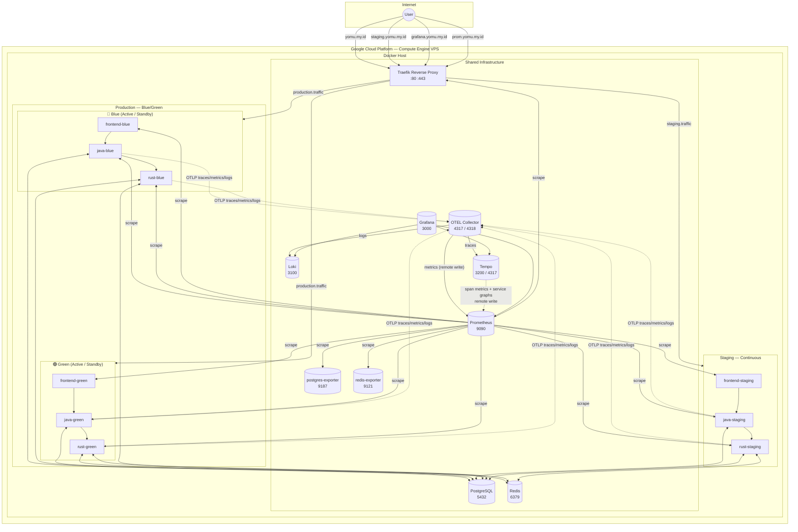
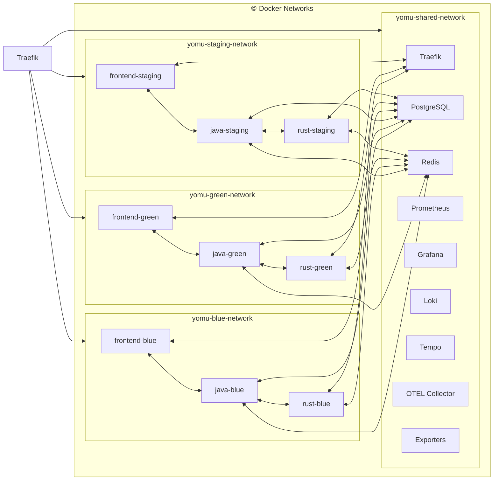
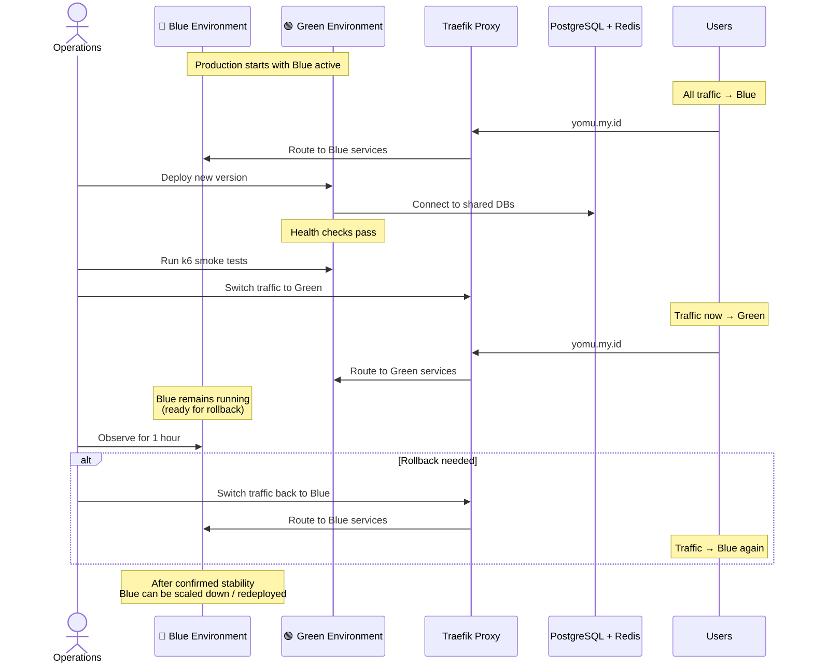
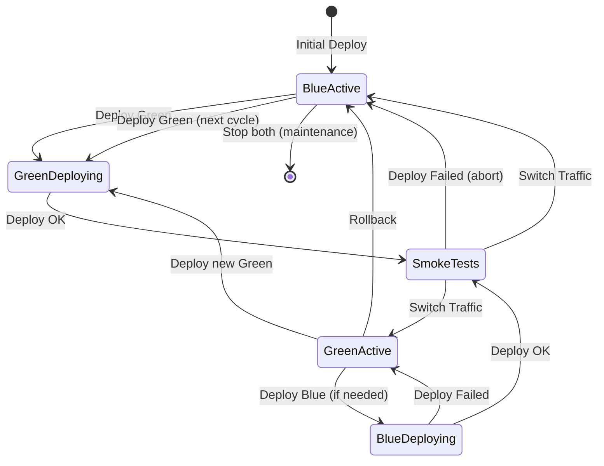
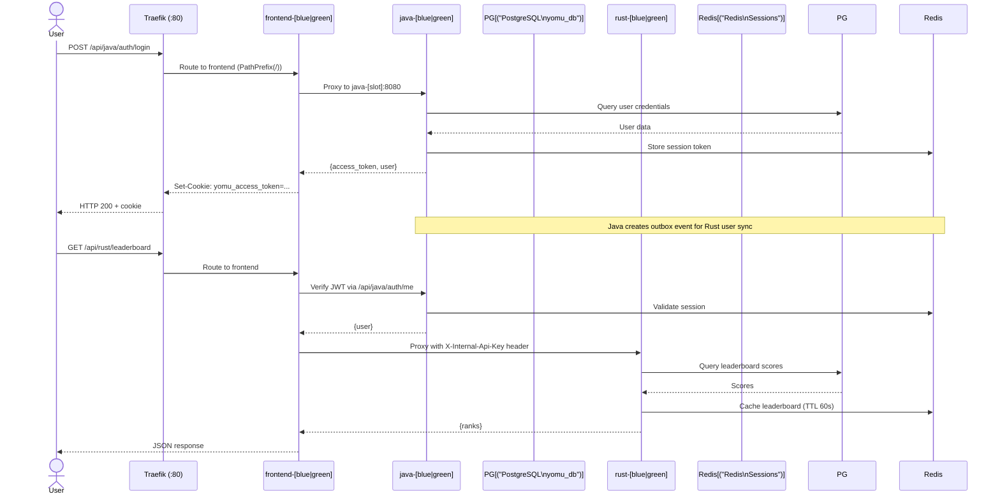
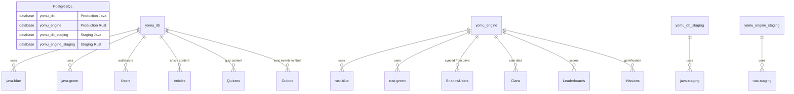
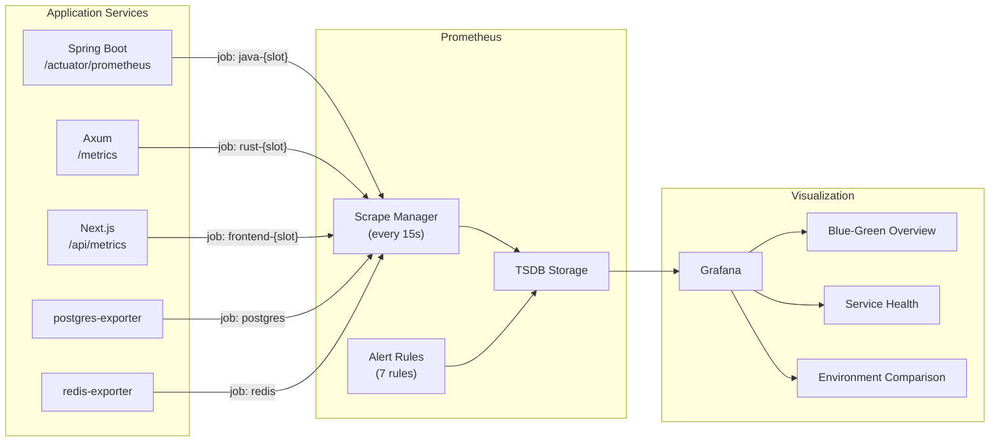
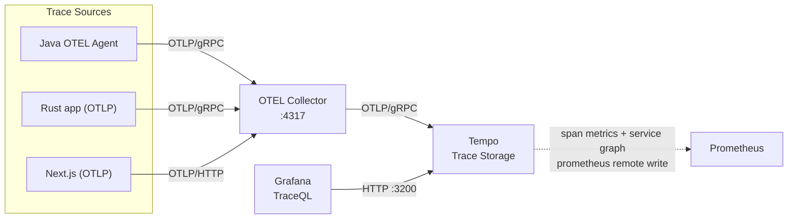
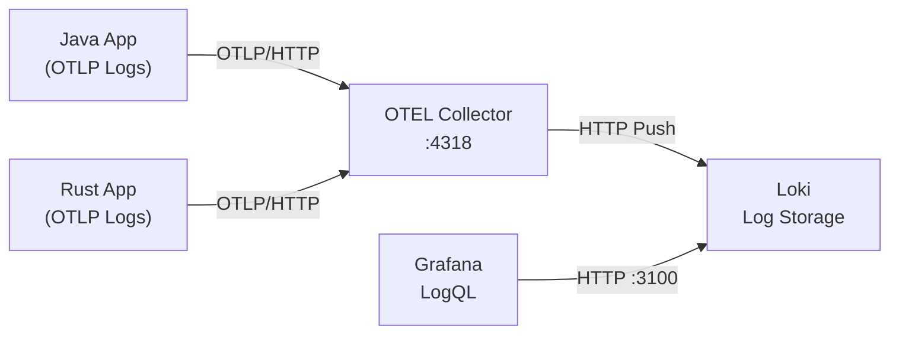
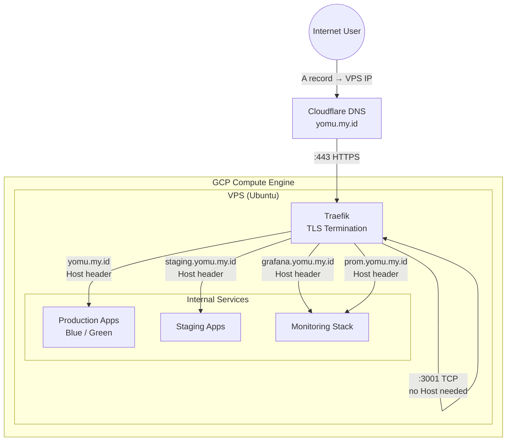

# Yomu Platform — Architecture

**Platform**: Google Cloud Compute Engine (VPS)
**Domain**: [yomu.my.id](https://yomu.my.id)
**Deployment**: Blue-Green via Docker Compose + Traefik
**Environments**: Production (blue/green), Staging

---

## 1. System Overview



### Components

| Component | Role | Docker Image | Internal Port |
|-----------|------|-------------|---------------|
| Traefik | Reverse proxy, TLS termination, routing | `traefik:v3.1` | :80, :443, :8080 (dashboard) |
| PostgreSQL | Relational DB (4 databases) | `postgres:18` | :5432 |
| Redis | Cache, session store, leaderboard | `redis:8-alpine` | :6379 |
| Prometheus | Metrics collection + alerting | `prom/prometheus:v2.53.0` | :9090 |
| Grafana | Metrics visualization + dashboards | `grafana/grafana:11.0.0` | :3000 |
| Loki | Log aggregation | `grafana/loki:3.0.0` | :3100 |
| Tempo | Distributed tracing storage + query | `grafana/tempo:2.5.0` | :3200 (HTTP), :4317 (OTLP gRPC) |
| OTEL Collector | Telemetry pipeline | `otel/opentelemetry-collector-contrib:0.104.0` | :4317, :4318, :8889 |
| postgres-exporter | PostgreSQL metrics → Prometheus | `prometheuscommunity/postgres-exporter:v0.15.0` | :9187 |
| redis-exporter | Redis metrics → Prometheus | `oliver006/redis_exporter:v1.58.0` | :9121 |

---

## 2. Network Architecture



### Network Isolation Rules

| Network | Members | Traffic |
|---------|---------|---------|
| `yomu-shared-network` | All shared infra + all app services | Cross-service discovery, DB access, telemetry |
| `yomu-blue-network` | `frontend-blue`, `java-blue`, `rust-blue` + Traefik | Internal blue env communication |
| `yomu-green-network` | `frontend-green`, `java-green`, `rust-green` + Traefik | Internal green env communication |
| `yomu-staging-network` | `frontend-staging`, `java-staging`, `rust-staging` + Traefik | Internal staging communication |

**Key**: Blue and Green services on different networks cannot communicate directly with each other — they go through PostgreSQL, Redis, or Traefik on the shared network. This prevents accidental cross-talk during switches.

---

## 3. Blue-Green Deployment Pattern



### State Machine



### Router Switching Mechanism

Traefik watches the `/etc/traefik/dynamic/` directory via the **file provider** with `watch: true`. To switch traffic between blue and green:

```bash
# Switch to Green
cp traefik/dynamic/green-active.yml traefik/dynamic/routing.yml
docker kill --signal=HUP traefik
```

Only `routing.yml` is loaded by Traefik at runtime. The switch is instantaneous (no container restart). The inactive environment stays running — if the new environment fails health checks, a single `rollback.sh` command restores traffic to the previous environment.

---

## 4. Request Routing

### Production Routing Matrix

| Host / Path | Router | Service | Environment |
|-------------|--------|---------|-------------|
| `yomu.my.id` / `/*` | `frontend-router` | Frontend (Blue or Green) | Active slot |
| `yomu.my.id/api/java/*` | `java-router` | Java Backend (Blue or Green) | Active slot (strip `/api/java`) |
| `yomu.my.id/api/rust/*` | `rust-router` | Rust Backend (Blue or Green) | Active slot (strip `/api/rust`) |
| `staging.yomu.my.id` / `/*` | `staging-frontend-router` | `frontend-staging` | Staging |
| `staging.yomu.my.id/api/java/*` | `staging-java-router` | `java-staging` | Staging (strip `/api/java`) |
| `staging.yomu.my.id/api/rust/*` | `staging-rust-router` | `rust-staging` | Staging (strip `/api/rust`) |
| `yomu.my.id/grafana/*` | `grafana-router` | Grafana | Infrastructure |
| `yomu.my.id/prometheus/*` | `prometheus-router` | Prometheus | Infrastructure |

### Data Flow: Login Request



---

## 5. Database Architecture



### Database Initialization

On first PostgreSQL start, `scripts/init-databases.sql` is mounted to `/docker-entrypoint-initdb.d/02-init-databases.sql` and executed automatically by the official PostgreSQL Docker image. The script is **idempotent** (uses `IF NOT EXISTS` guards) so it can safely re-run on container restart.

| Database | Created By | Used By | Purpose |
|----------|-----------|---------|---------|
| `yomu_db` | `${POSTGRES_DB}` env var | `java-blue`, `java-green` | Auth, users, articles, quizzes, outbox |
| `yomu_engine` | `init-databases.sql` | `rust-blue`, `rust-green` | Clans, scores, achievements, shadow users |
| `yomu_db_staging` | `init-databases.sql` | `java-staging` | Staging auth/users/articles |
| `yomu_engine_staging` | `init-databases.sql` | `rust-staging` | Staging clans/leaderboards |

---

## 6. Observability Stack (Full Telemetry)

### Metrics Pipeline



### Traces Pipeline



### Logs Pipeline



### Three Pillars Coverage

| Signal | Technology | Endpoint | Retention |
|--------|-----------|----------|-----------|
| **Metrics** | Prometheus (+ OTEL remote write) | `prometheus:9090` | Unlimited (local storage) |
| **Logs** | OTEL Collector → Loki | `loki:3100` | 7 days |
| **Traces** | OTEL Collector → Tempo | `tempo:3200` (query), `tempo:4317` (ingest) | 7 days |
| **Dashboards** | Grafana (auto-provisioned) | `grafana:3000` | Persistent (volume) |
| **Alerts** | Prometheus Alertmanager (rules defined) | Eval every 15s | — |

---

## 7. Domain and TLS Architecture



### DNS Records (yomu.my.id)

| Record | Type | Target | Purpose |
|--------|------|--------|---------|
| `yomu.my.id` | A | VPS Public IP | Production traffic |
| `staging.yomu.my.id` | A | VPS Public IP | Staging traffic |
| `grafana.yomu.my.id` | A | VPS Public IP | Grafana dashboard |
| `prom.yomu.my.id` | A | VPS Public IP | Prometheus (optional, restrict access) |

### TLS Options

1. **Let's Encrypt via Traefik** (recommended):
   Uncomment the `certificatesResolvers` block in `traefik/traefik.yml`. Traefik automatically requests and renews TLS certificates.

2. **Cloudflare Origin Certificates** (alternative):
   Download Cloudflare origin cert, mount to `/etc/traefik/certs/`, and configure TLS in dynamic config.

3. **Self-signed** (staging only):
   Generate with `openssl` and mount to traefik certificates directory.

---

## 8. Alerting Rules

| Alert | Severity | Trigger | Action |
|-------|----------|---------|--------|
| **ServiceDown** | 🔴 Critical | `up == 0` for 1m | Check `docker ps`, review `docker compose logs` |
| **BlueGreenOutOfSync** | 🔴 Critical | Both blue AND green have zero healthy services | Platform-wide outage — investigate infra |
| **DatabaseDown** | 🔴 Critical | `pg_up == 0` | Check PostgreSQL container health |
| **HighErrorRate** | 🟡 Warning | `rate(traefik_service_requests_total{code=~"5.."}[5m]) > 0.1` | Review application logs |
| **HighLatency** | 🟡 Warning | Traefik p95 latency > 2s for 5m | Check DB performance, JVM heap |
| **JavaHeapHigh** | 🟡 Warning | JVM heap > 85% for 5m | Restart Java service or increase memory limit |
| **DiskSpaceLow** | 🟡 Warning | Disk < 10% (if node-exporter present) | Clean logs, extend disk |

---

## 9. Directory Structure

```
yomu-deployment/
├── docker-compose/
│   ├── docker-compose.shared.yml         # Traefik, PostgreSQL, Redis, Prometheus, Grafana,
│   │                                      # Loki, Tempo, OTEL Collector, Exporters
│   ├── docker-compose.blue.yml            # frontend-blue, java-blue, rust-blue
│   ├── docker-compose.green.yml           # frontend-green, java-green, rust-green
│   ├── docker-compose.staging.yml        # frontend-staging, java-staging, rust-staging
│   └── .env.example                       # Secrets template
├── traefik/
│   ├── traefik.yml                        # Static config (entrypoints, TLS, Docker provider, file provider, metrics)
│   └── dynamic/
│       ├── blue-active.yml              # Production routing → Blue
│       ├── green-active.yml             # Production routing → Green
│       ├── routing.yml                   # Active routing (symlink/copy of blue or green)
│       └── staging.yml                   # Always-on staging routing
├── scripts/
│   ├── deploy-blue.sh                     # Deploy to Blue, wait for health
│   ├── deploy-green.sh                    # Deploy to Green, wait for health
│   ├── deploy-staging.sh                 # Deploy to Staging, wait for health
│   ├── switch-traffic.sh <blue|green>   # Switch Traefik routing + smoke test
│   ├── rollback.sh                       # Detect active, switch to other
│   ├── health-check.sh                    # Full platform health check
│   ├── full-deploy.sh                    # End-to-end: deploy → health → smoke → switch
│   └── init-databases.sql               # Create yomu_engine, yomu_db_staging, yomu_engine_staging
├── prometheus/
│   ├── prometheus.yml                     # 12 scrape jobs (6 prod + 3 staging + 2 exporter + traefik + prometheus)
│   └── rules/
│       └── alerts.yml                     # 7 alert rules
├── grafana/
│   ├── dashboards/
│   │   ├── yomu-blue-green-overview.json
│   │   ├── yomu-service-health.json
│   │   └── yomu-environment-comparison.json
│   └── provisioning/
│       ├── dashboards/dashboards.yml
│       └── datasources/datasources.yml
├── loki/loki-config.yml                   # 7-day retention, filesystem storage
├── tempo/tempo-config.yml                # OTLP ingest, local storage, span metrics
├── otel/otel-collector-config.yml        # 3 pipelines: traces→Tempo, metrics→Prometheus, logs→Loki
└── k6/                                    # Load test suites
    ├── smoke/, load/, stress/, spike/, soak/
    └── scripts/
```

---

## 10. Environments Summary

| Aspect | Production | Staging |
|--------|-----------|---------|
| **Strategy** | Blue-Green (one active at a time) | Always-on (no switching) |
| **DB** | `yomu_db`, `yomu_engine` | `yomu_db_staging`, `yomu_engine_staging` |
| **Redis** | Shared | Shared, with `staging_` prefix |
| **Domain** | `yomu.my.id` | `staging.yomu.my.id` |
| **Images** | `yomu-*:latest` (or specific tag) | `yomu-*:staging` |
| **Blue slot** | `frontend-blue`, `java-blue`, `rust-blue` | — |
| **Green slot** | `frontend-green`, `java-green`, `rust-green` | — |
| **Staging slot** | — | `frontend-staging`, `java-staging`, `rust-staging` |
| **Switch** | File-based Traefik HUP | No switch needed |
| **Rollback** | Instant: `rollback.sh` (switches to other slot) | Re-deploy from image |
| **Grafana dashboard** | Blue-Green Overview (+ env comparison) | Viewed via Environment Comparison dashboard |
