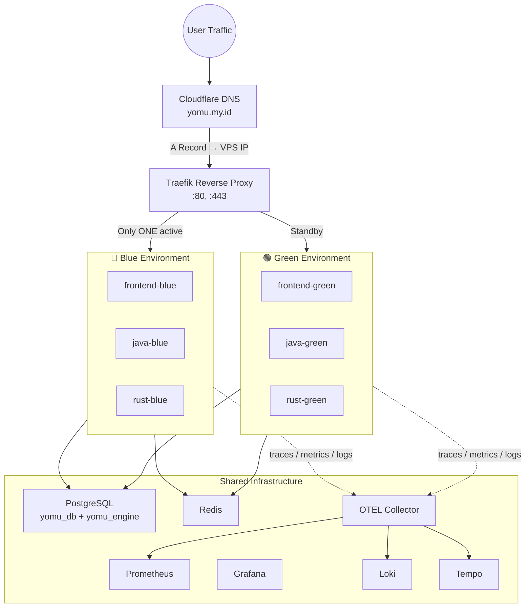

# Yomu Infrastructure

Infrastructure-as-Code for the Yomu polyglot learning platform on Google Cloud VPS.

## Stack

| Tool | Purpose | Port |
|------|---------|------|
| Traefik | Reverse proxy / load balancer | 80, 443, 3001 (dashboard) |
| Prometheus | Metrics collection | 9090 |
| Grafana | Metrics visualization | 3000 (via Traefik /grafana) |
| Loki | Log aggregation | 3100 |
| Tempo | Distributed tracing | 4317 (OTLP gRPC) |
| OTEL Collector | Trace/log/metrics pipeline | 4317, 4318, 8889 |
| K6 | Load testing | CLI |

## Blue-Green Deployment Architecture



**Key principle**: Only ONE environment (blue or green) receives production traffic at a time. The other environment can be updated, tested, and then swapped in with zero downtime.

## Prerequisites

- Docker 24+ with Docker Compose v2
- curl
- bash 4+
- (Optional) k6 for load testing

## Directory Structure

```
docker-compose/         # Compose fragments
  docker-compose.shared.yml   # Shared infra (Traefik, DBs, monitoring)
  docker-compose.blue.yml     # Blue app environment
  docker-compose.green.yml    # Green app environment
  .env.example                # Environment variable template

traefik/                # Reverse proxy config
  traefik.yml                 # Static config
  dynamic/
    blue-active.yml           # Blue routing rules
    green-active.yml          # Green routing rules
    routing.yml               # Active routing (symlinked to blue or green)

prometheus/             # Metrics
  prometheus.yml              # Scrape configs (all services)
  rules/
    alerts.yml                # Alerting rules

grafana/                # Dashboards
  dashboards/                 # JSON dashboard definitions
  provisioning/               # Auto-provisioning
    dashboards/
    datasources/

loki/                   # Log aggregation
  loki-config.yml             # Loki config
  retention/                  # Retention policy docs

tempo/                  # Distributed tracing
  tempo-config.yml            # Tempo config

otel/                   # OpenTelemetry
  otel-collector-config.yml   # Collector pipelines

scripts/                # Deployment scripts
  deploy-blue.sh              # Deploy blue environment
  deploy-green.sh             # Deploy green environment
  switch-traffic.sh           # Switch traffic between envs
  rollback.sh                 # Rollback to previous env
  health-check.sh             # Full health check
  full-deploy.sh              # End-to-end deploy pipeline

k6/                     # Load testing
  smoke/ smoke-test.js        # Quick validation
  load/ load-test.js          # Normal traffic simulation
  stress/ stress-test.js      # Breaking point test
  spike/ spike-test.js        # Sudden burst test
  soak/ soak-test.js          # Long-running stability
```

## Quick Start

### 1. Configure Environment

```bash
cp docker-compose/.env.example .env
# Edit .env with your secrets
```

Required secrets in `.env`:
- `POSTGRES_PASSWORD`
- `GRAFANA_ADMIN_PASSWORD`
- `JWT_SECRET`
- `INTERNAL_API_KEY`
- `JAVA_CORE_API_KEY`

### 2. Start Shared Infrastructure

```bash
docker compose -f docker-compose/docker-compose.shared.yml up -d
```

This starts: Traefik, PostgreSQL, Redis, Prometheus, Grafana, Loki, Tempo, OTEL Collector.

### 3. Deploy Blue Environment (initial active)

```bash
./scripts/deploy-blue.sh
./scripts/switch-traffic.sh blue   # Blue is already active by default
```

### 4. Access Services

| Service | URL | Notes |
|---------|-----|-------|
| Frontend | http://localhost/ | Next.js app |
| Java API | http://localhost/api/java/ | Spring Boot backend |
| Rust API | http://localhost/api/rust/ | Axum gamification engine |
| Grafana | http://localhost/grafana | Metrics dashboards |
| Prometheus | http://localhost/prometheus | Raw metrics |
| Traefik Dashboard | http://localhost:3001/dashboard/ | Routing visualization |

### 5. Check Health

```bash
./scripts/health-check.sh
```

## Blue-Green Deployment Workflow

### Scenario: Deploy a new version to production with zero downtime

```bash
# Step 1: Determine which environment is currently inactive
# (e.g., if blue is active, deploy to green)

# Step 2: Deploy new version to inactive environment
./scripts/deploy-green.sh --image-tag v1.2.3

# Step 3: Validate the new environment
./scripts/health-check.sh
# Or run k6 smoke test:
k6 run k6/smoke/smoke-test.js

# Step 4: Switch traffic to the new environment
./scripts/switch-traffic.sh green

# Step 5: (Optional) After confirming stability, stop the old environment
# docker compose -f docker-compose/docker-compose.blue.yml down
```

### Full Automated Deploy

```bash
./scripts/full-deploy.sh --target green --image-tag v1.2.3
```

This runs the complete pipeline:
1. Deploy to target environment
2. Health check
3. Smoke test
4. Traffic switch
5. (Stops on any failure, preserving current active environment)

### Rollback

```bash
./scripts/rollback.sh
```

Automatically detects the current active environment and switches back to the other one (if it's healthy).

## Docker Image Requirements

The deployment expects these pre-built Docker images:

| Image | Source |
|-------|--------|
| `yomu-frontend` | `yomu-frontend/Dockerfile` |
| `yomu-backend-java` | `yomu-backend-java/Dockerfile` |
| `yomu-backend-rust` | `yomu-backend-rust/Dockerfile` |

Build them from the respective subproject directories:

```bash
cd ../yomu-frontend && docker build -t yomu-frontend:latest .
cd ../yomu-backend-java && docker build -t yomu-backend-java:latest .
cd ../yomu-backend-rust && docker build -t yomu-backend-rust:latest .
```

## Monitoring & Observability

### Metrics (Prometheus + Grafana)

- **Prometheus**: http://localhost:9090 — scrape configs for all services, including blue/green slot labels
- **Grafana**: http://localhost/grafana — auto-provisioned with "Yomu Blue-Green Overview" and "Yomu Service Health" dashboards
- **Alert rules**: `prometheus/rules/alerts.yml` — `HighErrorRate`, `ServiceDown`, `JavaHeapHigh`, `HighLatency`, `DatabaseDown`, `BlueGreenOutOfSync`, `DiskSpaceLow`

### Logs (Loki)

- All container logs collected via Docker logging driver (configure in compose if needed)
- OTEL Collector forwards OTLP logs to Loki at `loki:3100`
- Loki retention: 7 days

### Traces (Tempo + OTEL)

- Java backend: auto-instrumented via OpenTelemetry Java agent (built into Docker image)
- Rust/Frontend: send traces to `http://localhost:4317` (OTEL Collector OTLP gRPC)
- Tempo storage: local filesystem (`/tmp/tempo/traces`)
- Tempo retention: 7 days
- Tempo generates span metrics + service graphs → forwarded to Prometheus

### Load Testing (k6)

```bash
# Quick validation (run before traffic switch)
./k6/scripts/run-smoke.sh

# Full load test suite
k6 run k6/load/load-test.js
k6 run k6/stress/stress-test.js
k6 run k6/spike/spike-test.js
k6 run k6/soak/soak-test.js
```

## Network Architecture

| Network | Members | Purpose |
|---------|---------|---------|
| `yomu-shared-network` | All shared infra + all apps | Service discovery, database access |
| `yomu-blue-network` | Traefik + blue apps | Blue environment isolation |
| `yomu-green-network` | Traefik + green apps | Green environment isolation |

## Security Notes

- No HTTPS/TLS configured by default (VPS with local network)
- Uncomment Let's Encrypt block in `traefik/traefik.yml` for production TLS
- Secrets must be set via `.env` file (never committed)
- Grafana sign-up is disabled
- All services run as non-root inside containers

## Troubleshooting

```bash
# View all running containers
docker compose -f docker-compose/docker-compose.shared.yml ps
docker compose -f docker-compose/docker-compose.blue.yml ps
docker compose -f docker-compose/docker-compose.green.yml ps

# View logs
docker compose -f docker-compose/docker-compose.shared.yml logs -f traefik
docker compose -f docker-compose/docker-compose.blue.yml logs -f java-blue

# Restart a service
docker compose -f docker-compose/docker-compose.blue.yml restart java-blue

# Check Traefik routing rules
curl -s http://localhost:3001/api/http/routers | jq .
```

## License

MIT OR Apache-2.0
