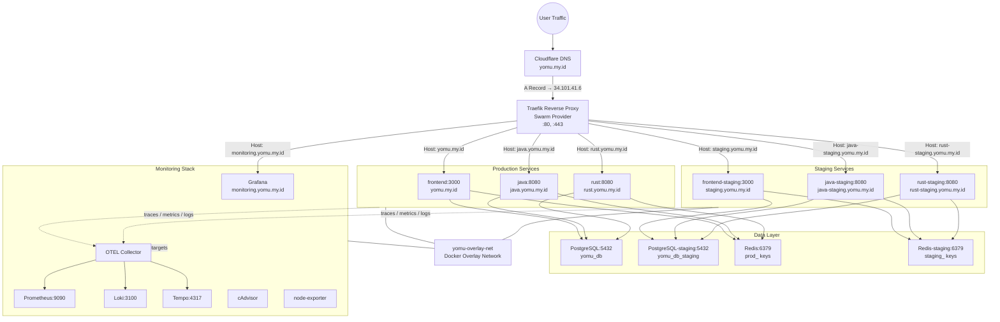
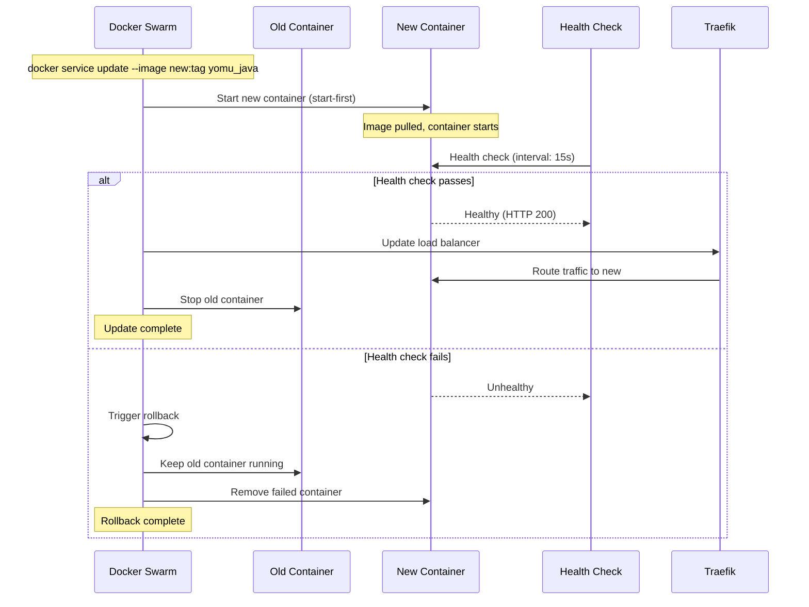
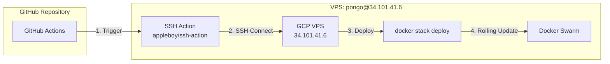

# Yomu Infrastructure

Infrastructure-as-Code for the Yomu polyglot learning platform on Google Cloud VPS.

## Stack

| Tool | Purpose | Port |
|------|---------|------|
| Traefik | Reverse proxy / load balancer | 80, 443, 3001 (dashboard) |
| Prometheus | Metrics collection | 9090 |
| Grafana | Metrics visualization | 3000 (via Traefik /grafana) |
| Loki | Log aggregation | 3100 |
| Tempo | Distributed tracing | 4317 (OTLP gRPC) |
| OTEL Collector | Trace/log/metrics pipeline | 4317, 4318, 8889 |
| K6 | Load testing | CLI |
| cAdvisor | Container metrics | 8080 |
| node-exporter | Node metrics | 9100 |
| redis-exporter | Redis metrics | 9121 |
| postgres-exporter | PostgreSQL metrics | 9187 |

## Swarm Rolling Deployment Architecture



**Key principles**:
- Single Docker Swarm cluster on GCP VPS (34.101.41.6)
- Rolling updates with zero downtime via `update_config`
- Subdomain-based routing through Traefik Swarm provider
- Production and staging coexist in the same stack with isolated databases
- Auto-rollback on health check failure

## Prerequisites

- Docker 24+ with Docker Swarm mode
- SSH access to VPS (user: `pongo`)
- curl, bash 4+
- (Optional) k6 for load testing
- GitHub repository with Actions permissions

### Initialize Docker Swarm

On the VPS, initialize Swarm mode if not already done:

```bash
docker swarm init
```

Create the overlay network:

```bash
docker network create --driver overlay --attachable yomu-overlay-net
```

## Directory Structure

```
yomu-deployment/
├── docker-compose/
│   ├── docker-compose.swarm.yml    # Single stack file (prod + staging)
│   └── .env.example                # Environment variable template
│
├── traefik/
│   ├── traefik.swarm.yml           # Traefik static config (Swarm provider)
│   └── dynamic/                    # Dynamic config directory
│
├── prometheus/
│   ├── prometheus.yml              # Scrape configs (all services)
│   └── rules/
│       └── alerts.yml              # Alerting rules
│
├── grafana/
│   ├── dashboards/                 # JSON dashboard definitions
│   └── provisioning/
│       ├── dashboards/
│       └── datasources/
│
├── loki/
│   └── loki-config.yml             # Loki config
│
├── tempo/
│   └── tempo-config.yml            # Tempo config
│
├── otel/
│   └── otel-collector-config.yml   # Collector pipelines
│
├── scripts/
│   ├── deploy-staging.sh           # Deploy staging services
│   ├── full-deploy.sh              # Full deployment pipeline
│   ├── health-check.sh             # Full health check
│   ├── rollback.sh                 # Manual rollback
│   ├── auto-rollback-monitor.sh    # Prometheus-based auto-rollback
│   ├── smoke-test-subdomains.sh    # Smoke tests for all subdomains
│   ├── cleanup-old-env.sh          # Cleanup old service versions
│   ├── init-databases.sh           # Database initialization
│   └── provision-gcp.sh            # GCP provisioning script
│
├── k6/
│   ├── smoke/
│   │   └── smoke-test.js           # Quick validation
│   ├── load/
│   │   └── load-test.js            # Normal traffic simulation
│   ├── stress/
│   │   └── stress-test.js          # Breaking point test
│   ├── spike/
│   │   └── spike-test.js           # Sudden burst test
│   └── soak/
│       └── soak-test.js            # Long-running stability
│
├── .github/
│   └── workflows/
│       ├── deploy-production.yml   # Production deployment
│       ├── deploy-staging.yml      # Staging deployment
│       └── test-deploy.yml         # Deployment testing
│
├── docs/                           # Additional documentation
├── ARCHITECTURE.md                 # Detailed architecture docs
├── SECRETS.md                      # Secrets management guide
└── README.md                       # This file
```

## Quick Start

### 1. Configure Environment

```bash
cd /opt/yomu
cp docker-compose/.env.example .env
# Edit .env with your secrets
```

Required secrets in `.env`:
- `POSTGRES_PASSWORD` - Database password
- `GRAFANA_ADMIN_PASSWORD` - Grafana admin password
- `JWT_SECRET` - JWT signing secret
- `INTERNAL_API_KEY` - Internal service authentication
- `JAVA_CORE_API_KEY` - Java-Rust service authentication
- `GOOGLE_OAUTH_CLIENT_ID` - Google OAuth client ID

### 2. Deploy the Full Stack

From the VPS, deploy the entire stack:

```bash
cd /opt/yomu
docker stack deploy -c docker-compose/docker-compose.swarm.yml yomu
```

This starts all services: Traefik, PostgreSQL, Redis, all application services (prod + staging), and the complete monitoring stack.

### 3. Verify Deployment

```bash
# List all services
docker service ls

# Check service status
docker stack ps yomu

# View service logs
docker service logs yomu_traefik --tail 50
```

### 4. Access Services

| Service | URL | Notes |
|---------|-----|-------|
| Frontend | https://yomu.my.id/ | Next.js app |
| Java API | https://java.yomu.my.id/ | Spring Boot backend |
| Rust API | https://rust.yomu.my.id/ | Axum gamification engine |
| Staging Frontend | https://staging.yomu.my.id/ | Staging environment |
| Staging Java | https://java-staging.yomu.my.id/ | Staging Java API |
| Staging Rust | https://rust-staging.yomu.my.id/ | Staging Rust API |
| Grafana | https://monitoring.yomu.my.id/ | Metrics dashboards |
| Prometheus | http://localhost:9090 | Raw metrics (localhost only) |
| Traefik Dashboard | http://localhost:3001/dashboard/ | Routing visualization |

### 5. Run Health Check

```bash
./scripts/health-check.sh
```

## Rolling Deployment Workflow

### How Rolling Updates Work



### Deployment Configuration

Each service in `docker-compose.swarm.yml` has rolling update configuration:

```yaml
deploy:
  update_config:
    parallelism: 1          # Update one container at a time
    delay: 15s              # Wait 15s between updates
    failure_action: rollback # Auto-rollback on failure
    order: start-first      # Start new before stopping old
```

### Manual Deployment Steps

```bash
# Step 1: Update a service with new image
docker service update \
  --with-registry-auth \
  --image ghcr.io/advprog-2026-a14-project/yomu-backend-java:v1.2.3 \
  yomu_java

# Step 2: Monitor rollout progress
docker service ps yomu_java

# Step 3: Check service health
docker service ls --filter name=yomu_

# Step 4: If issues, trigger manual rollback
docker service rollback yomu_java
```

### Full Deployment Pipeline

```bash
# Run the full deployment pipeline
./scripts/full-deploy.sh --image-tag v1.2.3
```

This runs:
1. Deploy new image to all production services
2. Wait for services to become healthy
3. Run smoke tests against all subdomains
4. Start auto-rollback monitor for 5 minutes
5. Notify Grafana of deployment

## CD Pipeline & VPS Trigger

### GitHub Actions Workflow

Production deployments are triggered by:
1. Push to `main` branch
2. `repository_dispatch` event
3. Manual `workflow_dispatch` trigger

### Workflow Architecture



### Deploy Workflow Triggers

```yaml
on:
  push:
    branches: [main]
  repository_dispatch:
    types: [deploy]
  workflow_dispatch:
    inputs:
      image_tag:
        description: 'Image tag to deploy'
        required: true
        default: 'main'
```

### SSH Deployment Step

The workflow uses `appleboy/ssh-action` to connect and deploy:

```yaml
- name: Deploy to VPS
  uses: appleboy/ssh-action@v1.0.3
  with:
    host: ${{ secrets.VPS_HOST }}
    username: ${{ secrets.VPS_USER }}
    key: ${{ secrets.VPS_SSH_KEY }}
    script: |
      cd /opt/yomu
      docker stack deploy -c docker-compose/docker-compose.swarm.yml yomu
```

### Staging Deployment

Staging uses a separate workflow that updates only staging services:

```bash
# Staging deploy script
./scripts/deploy-staging.sh --image-tag staging
```

This uses `docker service update` for individual staging services.

## Service URLs

### Production Endpoints

| Service | Subdomain | Health Endpoint |
|---------|-----------|-----------------|
| Frontend | yomu.my.id | GET / |
| Java API | java.yomu.my.id | GET /actuator/health/readiness |
| Rust API | rust.yomu.my.id | GET /health |
| Grafana | monitoring.yomu.my.id | GET /api/health |

### Staging Endpoints

| Service | Subdomain | Health Endpoint |
|---------|-----------|-----------------|
| Frontend | staging.yomu.my.id | GET / |
| Java API | java-staging.yomu.my.id | GET /actuator/health/readiness |
| Rust API | rust-staging.yomu.my.id | GET /health |

## Monitoring & Observability

### Metrics (Prometheus + Grafana)

- **Prometheus**: http://localhost:9090 - scrape configs for all services
- **Grafana**: https://monitoring.yomu.my.id/ - auto-provisioned dashboards
- **Alert rules**: `prometheus/rules/alerts.yml`
  - `HighErrorRate` - 5xx error rate exceeds threshold
  - `ServiceDown` - Service health check fails
  - `JavaHeapHigh` - JVM heap usage critical
  - `HighLatency` - P95 latency exceeds threshold
  - `DatabaseDown` - PostgreSQL unreachable
  - `DiskSpaceLow` - Disk usage critical

### Logs (Loki)

- All container logs collected via Docker logging driver
- OTEL Collector forwards OTLP logs to Loki at `loki:3100`
- Loki retention: 7 days
- Access via Grafana Explore panel

### Traces (Tempo + OTEL)

- **Java backend**: Auto-instrumented via OpenTelemetry Java agent
- **Rust/Frontend**: Send traces to `http://otel-collector:4317` (OTLP gRPC)
- **Tempo storage**: Local filesystem with 7-day retention
- **Span metrics**: Generated by Tempo and forwarded to Prometheus

### Container & Node Metrics

- **cAdvisor**: Container-level CPU, memory, network metrics
- **node-exporter**: Host-level system metrics
- **redis-exporter**: Redis performance metrics
- **postgres-exporter**: PostgreSQL query and connection metrics

### Load Testing (k6)

```bash
# Quick validation
k6 run k6/smoke/smoke-test.js

# Full load test suite
k6 run k6/load/load-test.js
k6 run k6/stress/stress-test.js
k6 run k6/spike/spike-test.js
k6 run k6/soak/soak-test.js
```

## Auto-Rollback

### Native Swarm Rollback

Docker Swarm automatically rolls back when:
- Health check fails during update
- Container exits with failure
- Update exceeds failure threshold

Configuration in `docker-compose.swarm.yml`:

```yaml
deploy:
  update_config:
    failure_action: rollback
```

### Prometheus-Based Auto-Rollback

The `auto-rollback-monitor.sh` script monitors production metrics and triggers rollback if thresholds are exceeded:

```bash
# Run auto-rollback monitor (5 minute watch)
./scripts/auto-rollback-monitor.sh
```

**Thresholds**:
- Error rate (5xx): > 5.0%
- P95 latency: > 2.0 seconds

**How it works**:
1. Queries Prometheus every 15 seconds
2. Checks error rate and latency against thresholds
3. If exceeded, runs `rollback.sh`
4. Rollback uses `docker service rollback` for all production services

## Network Architecture

| Network | Type | Members | Purpose |
|---------|------|---------|---------|
| `yomu-overlay-net` | Overlay | All services | Service discovery, inter-service communication |

All services run on a single Docker overlay network. Traefik discovers services automatically via Docker Swarm labels.

### Traefik Service Discovery

Traefik uses the Swarm provider to auto-discover services:

```yaml
providers:
  swarm:
    exposedByDefault: false
    network: yomu-overlay-net
    refreshSeconds: 5
```

Services define routing via labels:

```yaml
labels:
  - "traefik.enable=true"
  - "traefik.http.routers.java.rule=Host(`java.yomu.my.id`)"
  - "traefik.http.services.java.loadbalancer.server.port=8080"
```

## Security Notes

- TLS via Let's Encrypt (configured in `traefik.swarm.yml`)
- Secrets set via `.env` file (never committed to git)
- Grafana sign-up disabled
- All services run as non-root inside containers
- Database ports bound to localhost only (127.0.0.1)
- SSH key authentication for VPS access
- GitHub Actions secrets for CI/CD credentials

## Troubleshooting

### View Services

```bash
# List all Swarm services
docker service ls

# List services filtered by stack
docker service ls --filter name=yomu_

# View task status for a stack
docker stack ps yomu

# View detailed service info
docker service inspect yomu_java
```

### View Logs

```bash
# View service logs
docker service logs yomu_traefik --tail 100
docker service logs yomu_java --tail 100
docker service logs yomu_rust --tail 100

# Follow logs in real-time
docker service logs -f yomu_frontend

# View logs with timestamps
docker service logs -t yomu_java
```

### Restart Services

```bash
# Restart a single service
docker service update --force yomu_java

# Restart all services in stack
docker stack rm yomu
docker stack deploy -c docker-compose/docker-compose.swarm.yml yomu
```

### Check Health

```bash
# Run full health check
./scripts/health-check.sh

# Check individual service health
docker service ls --format '{{.Name}}: {{.Replicas}}'

# View service tasks with health status
docker stack ps yomu --format 'table {{.Name}}\t{{.CurrentState}}\t{{.DesiredState}}'
```

### Traefik Debugging

```bash
# Check Traefik routing rules
curl -s http://localhost:3001/api/http/routers | jq .

# Check Traefik services
curl -s http://localhost:3001/api/http/services | jq .

# View Traefik access logs
docker service logs yomu_traefik --tail 50
```

### Rollback

```bash
# Rollback a single service
docker service rollback yomu_java

# Manual rollback script
./scripts/rollback.sh
```

### Database Access

```bash
# Connect to PostgreSQL
docker exec -it $(docker ps --filter name=postgres --format '{{.ID}}') \
  psql -U postgres -d yomu_db

# Connect to staging PostgreSQL
docker exec -it $(docker ps --filter name=postgres-staging --format '{{.ID}}') \
  psql -U postgres -d yomu_db_staging
```

### Resource Limits

If services are OOM-killed, check resource usage:

```bash
# View container stats
docker stats

# Check service resource limits
docker service inspect yomu_java --format '{{.Spec.TaskTemplate.Resources.Limits}}'
```

## License

MIT OR Apache-2.0
